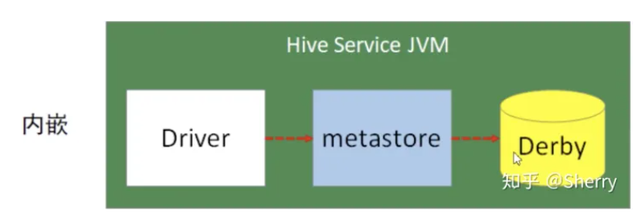
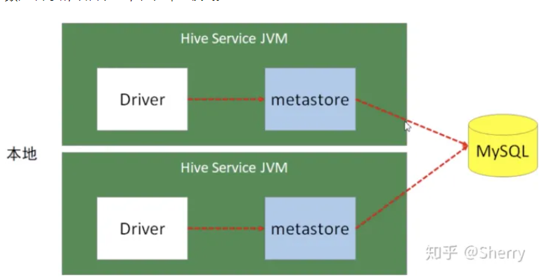

# Hive 元数据

## 第 1 节 Metastore
在Hive的具体使用中，首先面临的问题便是如何定义表结构信息，跟结构化的数据映射成功。所谓的映射指的是一种对应关系。在Hive中需要描述清楚表跟文件之间的映射关系、列和字段之间的关系等信息。这些描述映射关系的数据的称之为Hive的元数据。该数据十分重要，因为只有通过查询它才可以确定用户编写sql和最终操作文件之间的关系。

Metadata即元数据。元数据包含用Hive创建的database、table、表的字段等元信息。元数据存储在关系型数据库中。如hive内置的Derby、第三方如MySQL等。

Metastore即元数据服务，是Hive用来管理库表元数据的一个服务。有了它上层的服务不用再跟裸的文件数据打交道，而是可以基于结构化的库表信息构建计算框架。

通过metastore服务将Hive的元数据暴露出去，而不是需要通过对Hive元数据库mysql的访问才能拿到Hive的元数据信息，metastore服务实际上就是一种thrift服务，通过它用户可以获取到Hive元数据，并且通过thrift获取元数据的方式，屏蔽了数据库访问需要驱动，url，用户名，密码等细节。

### metastore三种配置方式 

####1、内嵌模式

内嵌模式使用的是内嵌的Derby数据库来存储元数据，也不需要额外起Metastore服务。数据库和Metastore服务都嵌入在主Hive Server进程中。
这个是默认的;但是一次只能一个客户端连接。

####2、本地模式
模式采用外部数据库来存储元数据，目前支持的数据库有：MySQL、Postgres、Oracle、MS SQL Server。
本地模式不需要单独起metastore服务，用的是跟Hive在同一个进程里的metastore服务。也就是说当启动一个hive服务时，其内部会启动一个metastore服务。Hive根据 **hive.metastore.uris** 参数值来判断，如果为空，则为本地模式。

